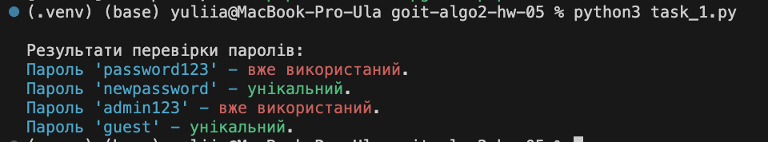
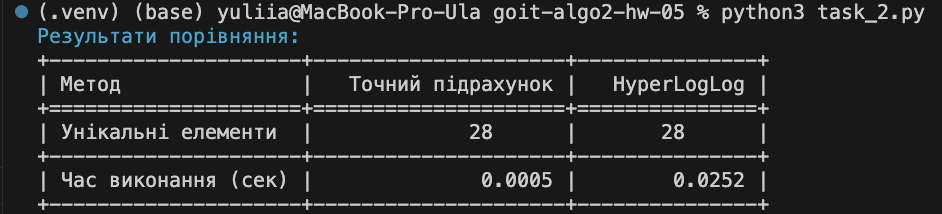

# Домашнє завдання до теми «Алгоритми роботи з великими даними»

Вітаємо! Як настрiй? Сподiваємося, що ви з нетерпiнням очікуєте на новий челендж
😉

Сьогодні ви здобудете навички використання фільтрів Блума й алгоритму
HyperLogLog при розв’язанні задач.

Домашнє завдання буде складатися з двох незалежних завдань.

Реалізація першого завдання — перевірки унікальності паролів — підготує вас до
розробки систем для роботи з великими даними, де збереження пам’яті та швидкість
обробки є критично важливими.

Виконуючи друге завдання, ви навчитесь працювати з різними підходами до
підрахунку унікальних елементів у великих наборах даних, зокрема точними
методами та наближеними алгоритмами, такими як HyperLogLog. Ви отримаєте досвід
аналізу продуктивності алгоритмів із використанням метрик часу виконання. Це
завдання допоможе розвинути навички оптимізації роботи з великими даними та
навчить застосовувати сучасні методи для ефективного вирішення завдань.

Нумо починати?! 💪🏼

## Завдання 1. Перевірка унікальності паролів за допомогою фільтра Блума

Створіть функцію для перевірки унікальності паролів за допомогою фільтра Блума.
Ця функція має визначати, чи використовувався пароль раніше, без необхідності
зберігати самі паролі.

### Технічні умови

1. Реалізуйте клас `BloomFilter`, який забезпечує додавання елементів до фільтра
   та перевірку наявності елемента у фільтрі.

2. Реалізуйте функцію `check_password_uniqueness`, яка використовує екземпляр
   `BloomFilter` та перевіряє список нових паролів на унікальність. Вона має
   повертати результат перевірки для кожного пароля.

3. Забезпечте коректну обробку всіх типів даних. Паролі слід обробляти просто як
   рядки, без хешування. Порожні або некоректні значення також мають бути
   враховані та оброблені належним чином.

4. Функція та клас мають працювати з великими наборами даних, використовуючи
   мінімум пам’яті.

### Критерії прийняття

📌 Критерії прийняття домашнього завдання є обов’язковою умовою розгляду
завдання ментором. Якщо якийсь з критеріїв не виконано, ДЗ відправляється
ментором на доопрацювання без оцінювання. Якщо вам «тільки уточнити»😉 або ви
«застопорилися» на якомусь з етапів виконання — звертайтеся до ментора у Slack.

1. Клас `BloomFilter` реалізує логіку роботи з фільтром Блума (20 балів).

2. Функція `check_password_uniqueness` перевіряє нові паролі, використовуючи
   переданий фільтр (20 балів).

3. Код виконує приклад використання відповідно до очікуваних результатів (10
   балів).

### Приклад використання

```python
if **name** == "**main**": # Ініціалізація фільтра Блума bloom =
BloomFilter(size=1000, num_hashes=3)

    # Додавання існуючих паролів
    existing_passwords = ["password123", "admin123", "qwerty123"]
    for password in existing_passwords:
        bloom.add(password)

    # Перевірка нових паролів
    new_passwords_to_check = ["password123", "newpassword", "admin123", "guest"]
    results = check_password_uniqueness(bloom, new_passwords_to_check)

    # Виведення результатів
    for password, status in results.items():
        print(f"Пароль '{password}' - {status}.")
```

### Результат

```bash
Пароль 'password123' — вже використаний.
Пароль 'newpassword' — унікальний.
Пароль 'admin123' — вже використаний.
Пароль 'guest' — унікальний.
```

## Завдання 2. Порівняння продуктивності HyperLogLog із точним підрахунком

унікальних елементів

Створіть скрипт для порівняння точного підрахунку унікальних елементів та
підрахунку за допомогою HyperLogLog.

### Технічні умови

1. Завантажте набір даних із реального лог-файлу `lms-stage-access.log`, що
   містить інформацію про IP-адреси.

2. Реалізуйте метод для точного підрахунку унікальних IP-адрес за допомогою
   структури set.

3. Реалізуйте метод для наближеного підрахунку унікальних IP-адрес за допомогою
   HyperLogLog.

4. Проведіть порівняння методів за часом виконання.

Критерії прийняття

1. Метод завантаження даних обробляє лог-файл, ігноруючи некоректні рядки (10
   балів).

2. Функція точного підрахунку повертає правильну кількість унікальних IP-адрес
   (10 балів).

3. HyperLogLog показує результат із прийнятною похибкою (10 балів).

4. Результати порівняння представлені у вигляді таблиці (10 балів).

5. Код є адаптованим до великих наборів даних (10 балів).

### Приклад виводу результатів

```bash
Результати порівняння:
                       Точний підрахунок     HyperLogLog
Унікальні елементи     100000.0              99652.0
Час виконання (сек.)   0.45                  0.1
```

## Підготовка й завантаження домашнього завдання

1. Створіть публічний репозиторій `goit-algo2-hw-05`.

2. Виконайте завдання й відправте його у свій репозиторій.

3. Завантажте робочі файли на свій комп’ютер та прикріпіть їх в LMS у вигляді
   zip архіву. Назва архіву повинна бути у форматі ДЗ5_ПІБ.

📌Файл логів завеликий, тому не прикріплюйте його в LMS: ймовірно це не вдасться
через обмеження.

4. Прикріпіть посилання на репозиторій `goit-algo2-hw-05` та відправте на
   перевірку.

## Формат здачі

- Прикріплені файли репозиторію у форматі zip з назвою ДЗ5_ПІБ.
- Посилання на репозиторій.

## Формат оцінювання

Оцінка від 0 до 100.

Завдання 1 оцінюється в 50 балів.

Завдання 2 оцінюється в 50 балів.

Докладний розподіл балів зазначений у критеріях прийняття.

☝🏻УВАГА!! У вас є можливість обрати підхід до виконання та можливого
доопрацювання домашнього завдання:

1. Задовольнитися першою отриманою оцінкою (звісно ж, якщо вона вище прохідного
   бала).
2. Намагатися отримати вищий бал шляхом можливого послідуючого доопрацювання
   роботи у відповідності з фідбеком ментора. Обраний підхід до виконання ДЗ
   необхідно зазначити у полі для здачі до прикріпленого завдання. За
   відсутності коментаря ментор дотримується першого підходу й виставляє
   отриману оцінку.

💡 Відправляйте ДЗ на перевірку, коли зроблено все можливе, оскільки кількість
спроб здачі завдання впливає на отриманий бал! За кожну наступну спробу,
починаючи з третьої, максимально можлива кількість балів зменшується на 5.
Критерії оцінювання робіт у магістратурі GoIt Neoversity

### Результат виконаного ДЗ

#### Завдання 1



#### Завдання 2


